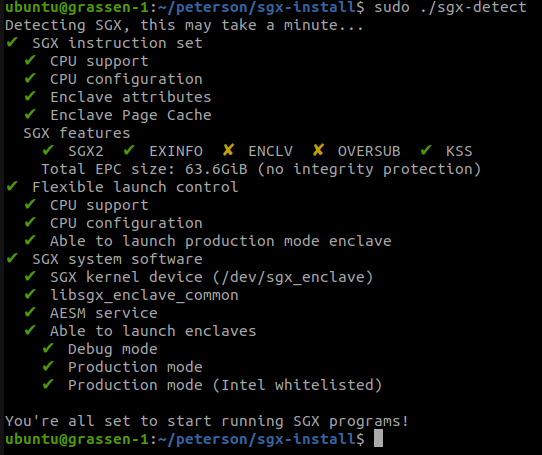

## Installing Intel SGX software tools
- To build and run Intel SGX enclaves, the following software need to be installed: 
1. The Intel SGX software development kit (SDK)
2. The Intel SGX platform software (PSW)
3. The Intel SGX driver 
- To install prebuilt versions of these tools (recommended approach), follow the instructions in this document: https://download.01.org/intel-sgx/latest/linux-latest/docs/Intel_SGX_SW_Installation_Guide_for_Linux.pdf  
- Link to prebuilt binaries: 
    1. Ubuntu 22.04: https://download.01.org/intel-sgx/latest/linux-latest/distro/ubuntu22.04-server/
    2. Ubuntu 20.04: https://download.01.org/intel-sgx/latest/linux-latest/distro/ubuntu20.04-server/

## Building from source
- To build the SDK, PSW and driver from source (not recommended for beginners), follow the guidelines provided in the following repositories:
1. https://github.com/intel/linux-sgx
2. https://github.com/intel/linux-sgx-driver


## Testing the installations
- The tool `sgx-detect` in this repo allows you to check your system system for SGX support as well as confirm the successful installation of the SGX driver, PSW, and SDK.
- Make the binary executable and run it as follows:
```bash
chmod +x sgx-detect
sudo ./sgx-detect
```
- You should have something similar to the following results.

- To run a simple SGX application, your results should have ticks at atleast: `SGX instruction set` --> `CPU support` and `SGX system software` --> `SGX kernel device`

## Running simple SGX application
- Clone the official Intel SGX SDK repo and build a sample enclave as below:
```bash
git clone https://github.com/intel/linux-sgx.git
cd linux-sgx/SampleCode/SampleEnclave
make 
./app
```
- If you have errors running the above, consider sending me an email at `petersonyuhala@gmail.com` with subject `SGX install issues`.

